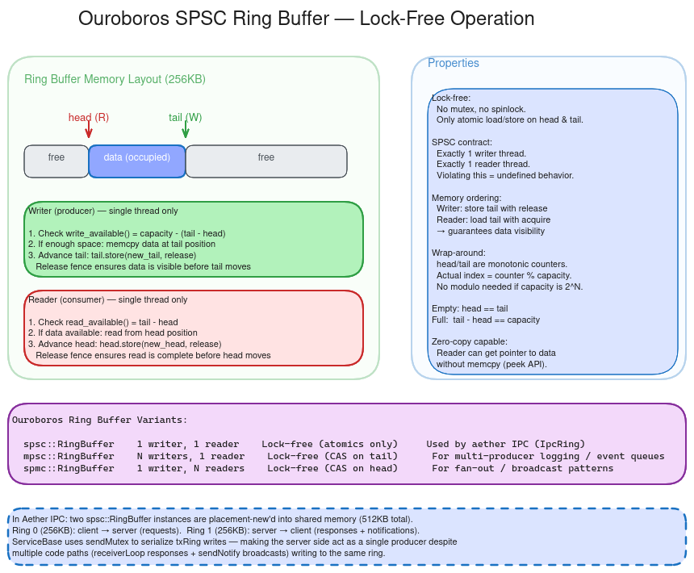

# Ouroboros Architecture Guide

This document explains the design of the Ouroboros ring buffer library.
For code walkthroughs and benchmarks, see the links in [Where to Go Next](#where-to-go-next).

---

## 1. What is Ouroboros

Ouroboros is a header-only, lock-free ring buffer library written in C++17. It provides three variants -- SPSC, MPSC, and SPMC -- each living in its own namespace and header under `inc/`. The library is generic over any trivially copyable type `T`, with a compile-time-fixed capacity that must be a power of two.

The primary design goals are zero-copy shared-memory compatibility and minimal cache contention. The entire buffer (control block plus data array) is laid out contiguously with no pointers, so it can be placed directly in an `mmap`'d region or a shared memory segment. This is what makes it suitable as the data-plane transport for the Aether IPC framework.

Ouroboros requires no dynamic allocation, no locks, and no system calls on the fast path. A `push`/`pop` pair touches two atomic variables and a `memcpy` -- nothing else.

---

## 2. Ring Buffer Fundamentals

A ring buffer is a fixed-size array used as a circular queue. Two cursors -- **head** (write position) and **tail** (read position) -- chase each other around the array. The producer advances head; the consumer advances tail. When a cursor reaches the end of the array it wraps back to the beginning, creating the illusion of an infinite stream over finite memory.

The diagram above shows the physical layout: head and tail are monotonically increasing 32-bit integers that are masked (`index & (Capacity - 1)`) to produce an array offset. Because the capacity is always a power of two, this masking is a single bitwise AND -- no modulo division required. The difference `head - tail` gives the number of elements currently in the buffer, even when both cursors have wrapped past `UINT32_MAX`, thanks to unsigned arithmetic.

The **empty condition** is `head == tail` (nothing to read). The **full condition** is `head - tail == Capacity` (no room to write). These two checks are the gatekeepers for every read and write operation.

---

## 3. The SPSC Variant

The SPSC (single-producer, single-consumer) ring buffer is the core of the library. It lives in `ouroboros::spsc` and is defined entirely in `inc/spsc/RingBuffer.h`. This is the variant used by Aether IPC for its shared-memory data plane.

SPSC is the simplest and fastest variant because each cursor is owned by exactly one thread. The producer only writes `head`; the consumer only writes `tail`. Neither thread ever needs a compare-and-swap (CAS) loop -- a plain atomic store is sufficient. This makes the SPSC variant not just lock-free but **wait-free**: every operation completes in bounded time regardless of what the other thread is doing.

The control block places `head` and `tail` on separate cache lines (64 bytes by default, configurable to 128 for Apple M-series / ARM big cores). This padding eliminates false sharing: the producer's stores to `head` never invalidate the consumer's cache line for `tail`, and vice versa. On a typical x86 or ARM system, this means the two threads can run on different cores without triggering cache-coherence traffic on every operation.

SPSC also offers bulk operations (`write()`/`read()`, `peek()`, `skip()`) that transfer multiple elements in one or two `memcpy` calls, handling the wrap-around split internally. These are critical for byte-stream IPC where messages span many bytes.

---

## 4. Write Operation

The producer writes data through `push()` (single element) or `write()` (bulk). Both follow the same three-step protocol.

**Step 1 -- Check space.** The producer loads its own `head` with relaxed ordering (it is the sole writer) and loads the consumer's `tail` with acquire ordering (to see the consumer's latest progress). The available space is `Capacity - (head - tail)`. If fewer than `count` slots are free, the call returns false immediately -- Ouroboros never blocks.

**Step 2 -- Copy data.** The producer computes the physical offset (`head & Mask`) and determines whether the write wraps around the end of the array. If it fits in one contiguous region, a single `memcpy` suffices. If it straddles the boundary, two `memcpy` calls cover the tail-end and wrap-around portions. Because `T` is required to be trivially copyable, `memcpy` is both safe and optimal.

**Step 3 -- Publish.** The producer stores `head + count` with release ordering. This is the critical fence: it guarantees that all the `memcpy`'d data is visible to the consumer before the consumer sees the updated head. Without this release-store, the consumer could observe the new head value but read stale or partially written data.

---

## 5. Read Operation

The consumer reads data through `pop()` (single element) or `read()` (bulk). The protocol mirrors the write path.

**Step 1 -- Check available.** The consumer loads the producer's `head` with acquire ordering (to see newly published data) and its own `tail` with relaxed ordering. The available count is `head - tail`. If fewer than `count` elements are present, the call returns false.

**Step 2 -- Copy data.** The consumer computes the physical offset (`tail & Mask`) and performs one or two `memcpy` calls, handling wrap-around the same way the producer does. The `peek()` method performs this same copy without advancing the tail, which is useful for protocols that need to inspect a frame header before committing to consume the full message.

**Step 3 -- Advance.** The consumer stores `tail + count` with release ordering. This release-store tells the producer that those slots are now free for reuse. The producer will see the updated tail on its next `writeAvailable()` check via the acquire-load described in the write path.

---

## 6. Memory Ordering

Ouroboros relies on acquire/release semantics -- not sequential consistency, and not relaxed-everywhere. Understanding why requires thinking about what each thread needs to see.

The fundamental invariant is: **data written by the producer must be visible to the consumer before the consumer reads it, and slots freed by the consumer must be visible to the producer before the producer overwrites them.** Acquire/release pairs enforce exactly this. When the producer does a release-store on `head`, it creates a happens-before edge: everything the producer wrote (the `memcpy`'d payload) is guaranteed to be visible to any thread that later does an acquire-load of `head` and sees the new value. The same logic applies symmetrically to the consumer's release-store on `tail`.

Each thread loads its own cursor with relaxed ordering because no synchronization is needed -- it is the only writer. Each thread loads the other's cursor with acquire ordering to pick up the latest published state. This is the minimum ordering that preserves correctness, and it matters for performance: on ARM and other weakly-ordered architectures, acquire/release compiles to cheaper barrier instructions than sequential consistency. On x86, the difference is smaller (x86 stores are already release), but the relaxed self-loads still avoid unnecessary fence instructions.

Without these fences, the failure mode is subtle and platform-dependent. On x86 you might never see a bug in testing. On ARM, you would eventually observe the consumer reading a partially written element, or the producer overwriting a slot the consumer has not yet finished reading. The acquire/release protocol prevents both.

---

## 7. The MPSC Variant

The MPSC (multiple-producer, single-consumer) ring buffer lives in `ouroboros::mpsc` (`inc/mpsc/RingBuffer.h`). It uses a Vyukov-style bounded queue with per-slot sequence counters.

Unlike SPSC, multiple producers must coordinate access to the head cursor. MPSC solves this with a CAS (compare-and-swap) loop: each producer atomically claims a slot by advancing `head`, then writes its data, then publishes by storing a sequence number on the slot. The consumer reads slots in order, checking each slot's sequence counter to confirm the data has been published, and resets the sequence to free the slot for the next lap.

The per-slot sequence counter also provides ABA safety. A producer can only claim a slot when the sequence matches the current lap value. After the consumer frees the slot, the sequence jumps forward by `Capacity`, so it will not match again until head wraps an entire lap -- effectively impossible with 32-bit counters at reasonable capacities.

MPSC is not wait-free: under contention, producers retry the CAS loop. It also has higher per-slot memory overhead (`sizeof(atomic<uint32_t>)` per slot) and does not support bulk operations. Use MPSC when multiple threads need to enqueue work for a single consumer -- for example, a logging sink or an event aggregator.

---

## 8. The SPMC Variant

The SPMC (single-producer, multiple-consumer) ring buffer lives in `ouroboros::spmc` (`inc/spmc/RingBuffer.h`). It is the structural mirror of MPSC: same slot layout, same sequence protocol, but the CAS coordination moves from producers to consumers.

The single producer writes without contention -- it checks the slot sequence, copies data, publishes the sequence, and advances `head`. Multiple consumers compete for slots by CAS-looping on `tail`. On success, a consumer reads the slot data and resets the sequence counter to free the slot.

SPMC shares the same trade-offs as MPSC relative to SPSC: no bulk operations, higher per-slot memory, and CAS retries under contention on the consumer side. Use SPMC when a single source fans out work to a pool of consumer threads -- for example, a task scheduler distributing jobs to workers.

MPMC (multiple-producer, multiple-consumer) is intentionally not provided. It would require CAS on both sides with marginal benefit over a spinlock queue at low contention, and well-tested implementations already exist in libraries like Folly and Boost.Lockfree.

---

## 9. Integration with Aether IPC

The Aether IPC framework uses Ouroboros SPSC ring buffers as its shared-memory data plane. Each connection between a service and a client creates a shared memory region containing **two** `ByteRingBuffer<262144>` instances (256 KB each) -- one for server-to-client traffic (tx) and one for client-to-server traffic (rx). The `FrameIO` layer writes framed messages (24-byte header plus variable payload) into these rings.

Because the SPSC ring buffer is strictly single-producer, single-consumer, Aether must enforce this contract even when the server has multiple internal threads that might send to the same client. It does this with a `sendMutex` on each `ClientConn` that serializes all writes to a client's tx ring. The mutex is held only for the duration of the `write()` call, so the lock-free ring itself still provides the performance benefit -- the mutex simply ensures that only one thread is the "producer" at any given moment.

The control plane (Unix domain sockets for handshake, FD passing, wakeup signals) is entirely separate from the data plane. Once a connection is established and the shared memory region is mapped into both processes, all message traffic flows through the SPSC rings with no system calls. This separation is what gives Aether its low-latency, high-throughput characteristics for IPC.

---

## 10. Where to Go Next

- **[WalkthroughSPSC.md](../WalkthroughSPSC.md)** -- A line-by-line guided tour of the SPSC implementation, explaining every design decision with direct references to the source code. Start here if you want to understand the "why" behind each line.

- **[MPSC Design](../inc/mpsc/DESIGN.md)** -- Detailed design document for the MPSC variant, including the CAS protocol, memory ordering rationale, and ABA safety analysis.

- **[SPMC Design](../inc/spmc/DESIGN.md)** -- Detailed design document for the SPMC variant, mirroring the MPSC design with the contention moved to the consumer side.

- **[README.md](../README.md)** -- Quick start, build instructions, and links to the live dashboard with throughput benchmarks, code-size reports, and test coverage.

- **[FUTURE.md](../FUTURE.md)** -- Trade-off comparison table across all variants and rationale for why MPMC is not planned.
